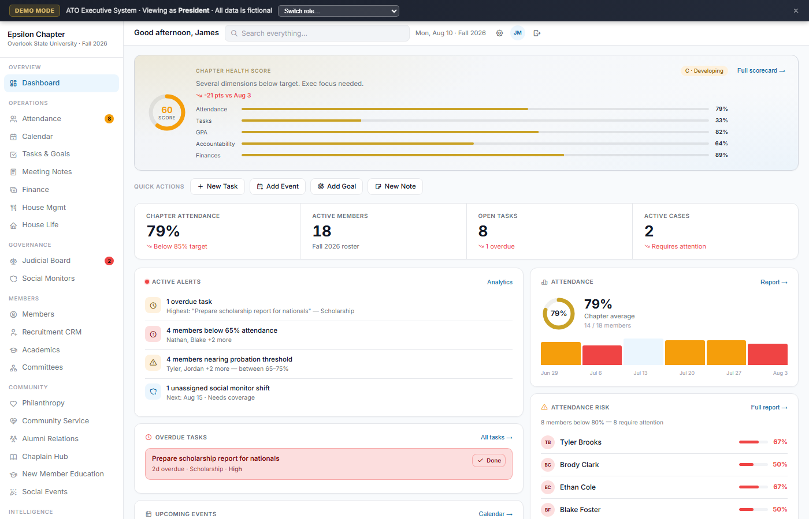
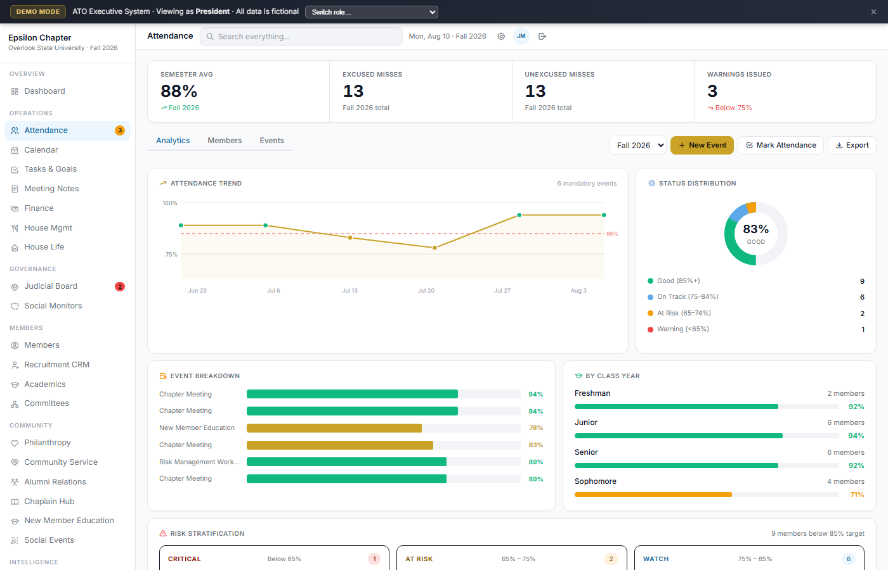
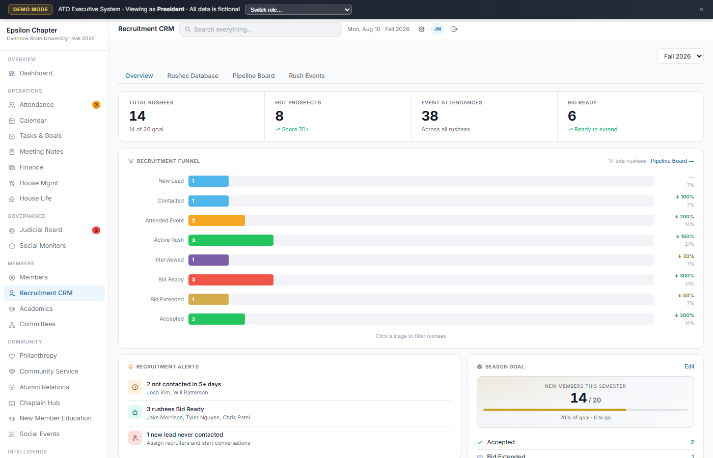
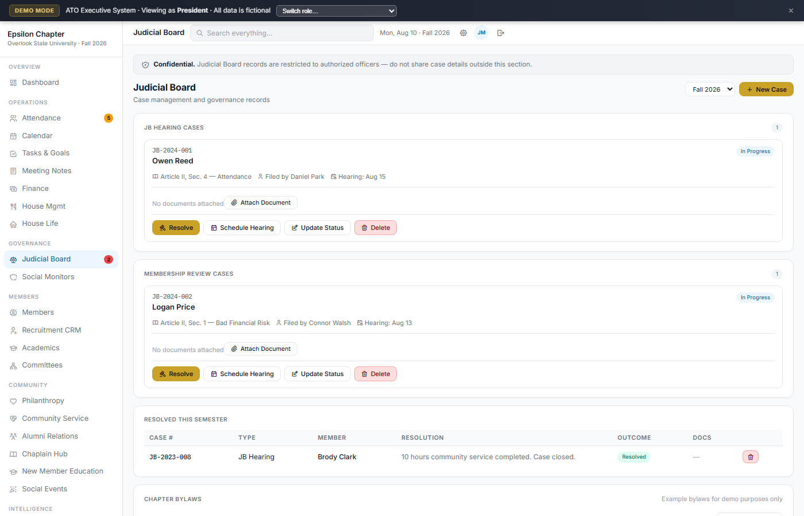

# ATO Executive System: Live Demo




**ATO Executive System** replaces the spreadsheets and email threads a real chapter was running on. It's an all-in-one executive operations platform for Alpha Tau Omega fraternity chapters: attendance, finance, recruitment CRM, judicial cases, officer succession, and every other operational domain a chapter runs, unified into a single role-aware SPA.

This repo is the actual production frontend, running against fictional seed data instead of a live chapter's real Firebase backend. See [Demo vs. Production](#demo-vs-production) below for exactly what that means.

**[Live Demo →](https://ops-core-nine-rho.vercel.app/)** · No login required · All data is fictional seed data

---

## Business Impact

- Replaced disconnected spreadsheets, email threads, and manual operational workflows with one centralized chapter-management platform
- Improved visibility across attendance, finance, recruitment, accountability, committees, and executive reporting
- Created a shared source of operational information for a multi-dozen-member chapter
- Supported leadership decision-making through KPI dashboards, alerts, reporting, and role-aware access
- Demonstrated how business requirements can be translated into a deployed information system

---

## 26 Operational Modules

| Module | What it does |
|---|---|
| **Dashboard** | Chapter Health Score (0–100), KPI ring, lead-posted Announcements widget (pinned + expiring), upcoming events, overdue tasks, active alerts, attendance risk list |
| **Attendance** | Per-event tracking (Present / Excused Miss / Unexcused Miss, marked by the Secretary, no self-service check-in, which is easy to share or screenshot and defeats the point of tracking who actually showed up), semester average, class-year breakdown, warning threshold alerts, trend chart, and an Unexcused Miss can prompt a fine on the spot, posted straight to Finance |
| **Calendar** | Month/week view, multi-day event support (e.g. a 2-day Formal stays one record), Committee Meeting/Exec Event/Brotherhood/Social categories, mandatory-event flags |
| **Tasks & Goals** | Kanban + list view, priority levels, position-scoped assignment, due dates, completion tracking, semester goal tracking, CSV import |
| **Meeting Notes** | Structured minutes with officer reports, announcements, old/new business, weekly honors; PDF export |
| **Finance** | Dues ledger (tiered by in-house/out-of-house/new-member rate), expense log, budget tracking, fine management (including fines issued directly from Attendance for an Unexcused Miss), national dues, payment plans |
| **Recruitment CRM** | Rushee pipeline (prospect → bid → pledge), funnel chart, stage conversion rates, rush event schedule |
| **Judicial Board** | JB Hearing and Membership Review case tracks, document attachments, hearing scheduling, outcome logging, importable chapter bylaws |
| **Social Monitors** | Weekly sober-monitor grid (one card per weekend, Thu/Fri/Sat columns, per-day slot counts), new-member training mode (new members shadow active brothers on Thu/Fri once a start date is set), CSV import |
| **Members** | Full roster with GPA, class year, membership status, role, contact info, mobile card view, CSV import (add or bulk-update by name match) |
| **Academics** | GPA distribution, chapter average, scholarship tracking, academic warning list, CSV grade import, hard-gated to authorized roles |
| **Committees** | Committee roster, chair assignment, custom positions, per-committee event calendar and file storage |
| **Analytics** | Deep-dive numbers behind attendance, academics, finance, and recruitment, shared with the Health Scorecard so the two never disagree |
| **Philanthropy** | Fundraising log, goals vs. funds raised, organizations directory, vendors/donors directory |
| **Community Service** | Service-hour logging by member and event, goal tracking (total hours / events / per-member requirement), volunteer leaderboard, service-location directory |
| **Alumni Relations** | Alumni directory, engagement tracking, outreach log, alumni event tracking |
| **Chaplain Hub** | Devotionals log, Brotherhood Events Tracker with a 4-column drag-and-drop planning board (Idea → Planning → Scheduled → Completed) (those events live on the shared Calendar, not a separate copy) and the preserved ritual checklist |
| **New Member Education** | Progress tracker against configurable requirements (driven by membership status, not class year), education-session scheduling with attendance, plus a full **Peer Mentor Program**: mentor-group cards, mentor/new-member assignment, and a CSV-importable week-by-week mentor agenda |
| **Social Events** | Event list plus a per-event workspace (Overview, Checklist, Budget, Vendors, Formal Details tabs) covering venue/transportation/lodging/catering/entertainment/security and budget vs. actual; general members get a read-only view |
| **Health Scorecard** | Composite chapter health across 8 weighted dimensions (attendance, tasks, academics, accountability, finances, recruitment, community service, alumni), with historical trend |
| **Transition Hub** | Role handoff docs for all 15 officer positions: responsibilities, recurring tasks, key contacts, "wish I knew" notes |
| **Reports** | Exportable summaries: semester report, officer report, financial report, attendance report |
| **Files & Documents** | Position-based folder storage, chapter-wide document library, per-committee file spaces |
| **Settings** | Chapter profile, positions & permissions (read-only display), enabled modules, officer account list |
| **House Management** | Weekly Meal Duties schedule (lunch/dinner slot assignment), example chore checklist across house areas with day-specific recurrence |
| **House Life** | Room assignments and a configurable priority-points rubric for room/parking selection |

CSV import (Members, Academics, Tasks, Social Monitors, Mentor Program Agenda) parses the file entirely in the browser and merges rows into the in-memory demo dataset. Nothing is uploaded anywhere, and nothing survives a page refresh, consistent with the rest of this demo.

> Bylaws, budget categories, and the house chore checklist shown in this demo are illustrative examples, not any real chapter's actual documents.

> **Not in this demo:** platform-level, multi-chapter administration (provisioning new chapters, cross-chapter officer approval). That capability exists in the production system this demo is based on, but is intentionally out of scope here since this demo shows a single chapter's operations, not platform administration.

---

## Role-Based Access Control

RBAC operates on two layers: **page access** (which modules appear in the sidebar) and **edit access** (which actions render within a page). Both layers update live when switching roles in the demo banner, driven by the exact same permission logic the real system uses, not a simplified demo stand-in.

### Page Access

Every exec-tier position shares a common view baseline (Dashboard, Calendar, Tasks, Files, Settings, Analytics, Reports, Health Scorecard, Transition Hub, Committees, Notes, Attendance, Finance, Philanthropy, Community Service, Alumni, Social Monitors, Chaplain Hub, New Member Education, Members, House Mgmt, Recruitment CRM, Social Events, House Life). Specialized positions get **edit** rights layered on top of that:

| Position | Additional Edit Access |
|---|---|
| President / Vice President | Full access to every module (lead) |
| Treasurer | Finance |
| Secretary | Attendance, Notes, Members, House Life |
| Risk Manager | Social Monitors, Attendance, + view on Academics |
| Recruitment | Recruitment CRM |
| Scholarship | Academics |
| Philanthropy | Philanthropy |
| Community Service | Community Service |
| Alumni | Alumni Relations |
| House Manager | House Mgmt |
| Membership Educator | New Member Education |
| Chaplain | Chaplain Hub |
| Social | Social Monitors, Social Events |
| Public Relations | View baseline only |
| General Member (viewer) | Read-only on Calendar, Members, Committees, Philanthropy, Community Service, Alumni, Chaplain Hub, Attendance, Notes, Social Monitors, House Mgmt, Social Events, House Life. No Dashboard, Tasks, Judicial Board, Academics, Transition Hub, Health Scorecard, Reports, Finance, Files, Settings, Analytics, or Recruitment CRM, and no edit controls anywhere |

Every position can also edit Calendar and the Transition Hub, regardless of what else it owns, those two aren't tied to any single position's domain.

### Edit Access (within-page RBAC)

Having view access to a page doesn't mean full write access: add/edit/delete controls are conditionally rendered based on position, same as production.

All non-lead positions can **view** their granted pages but not modify them unless the page above lists them for edit access. Edit buttons, import controls, and add actions are hidden, not just disabled.

---

## Demo vs. Production

> **What you're seeing is a fully client-side demo.** All data is fictional seed data loaded in-memory on page load: no login required, nothing is persisted, and no Firebase calls are made. `js/firebase.js` (the real Firebase SDK bootstrap) isn't even loaded; every Firestore-touching function in the copied production code self-guards on that and becomes a silent no-op.
>
> The production system replaces this demo's auto-login with a live Firebase backend: **Firestore** for real-time document storage and **Firebase Authentication** for identity. RBAC is enforced server-side: role and position assignments live in Firestore, resolved on login, so no client-side role can be spoofed. The offline cache (localStorage) syncs back to Firestore when connectivity is restored.

---

## Demo Data

The demo auto-signs in as **James Mitchell, President of Epsilon Chapter at Overlook State University** (a fictional chapter, not any real ATO chapter's data) with a complete seed dataset:

- **18 members**: names, class years, GPAs, positions, membership status (Active / New Member), contact info, dues status, attendance history
- **24 calendar events**: 6 past mandatory events with per-member attendance records, plus philanthropy, service, fundraiser, social, and brotherhood events (the latter doubling as the Chaplain Hub's Brotherhood Events Tracker) spanning past and upcoming
- **12 tasks + 5 semester goals**: mix of open, in-progress, overdue, and completed, each tied to a real officer position
- **Finance**: tiered dues (in-house / out-of-house / new-member rate) for all 18 members, 7 expenses mapped to real budget categories, budget line items, payment history, 2 outstanding fines
- **14 rushees**: across 5 funnel stages with bid scores, recruiter assignments, and 5 rush events
- **Judicial cases**: 3 cases (2 active: one JB Hearing, one Membership Review; 1 resolved) with bylaw citations and hearing dates
- **3 social monitor weekends**: a fully-staffed past weekend, an upcoming one with new-member training active and one open slot, and a formal weekend with a Wednesday pre-party and a bumped-up Saturday slot count
- **4 committees**: with chairs and member rosters
- **Philanthropy**: 3 fundraising events, a fundraising log, 2 partner organizations, 2 vendors/donors
- **Community Service**: 2 service events, hours logged for 12 members, 2 service locations
- **Chaplain Hub**: 2 devotionals log entries, 3 bible studies, 6 brotherhood/morale events across all 4 planning stages, a 12-item ritual checklist, and the full 13-chapter Bible Study curriculum (auto-seeded structure, same as production)
- **New Member Education + Peer Mentor Program**: 3 requirements tracked for 3 new members, 4 education sessions, 2 mentor groups, and a seeded 10-week mentor agenda
- **Social Events**: 3 events (a completed mixer, an in-progress formal with full vendor/budget detail, and an early-stage date party), 4 vendors
- **Announcements**: 3 seeded posts, one pinned, demonstrating the Dashboard broadcast widget
- **5 alumni contacts**: with engagement status, outreach log, and upcoming alumni event
- **15 transition hub entries**: handoff docs for all officer positions, with position-specific content and key contacts
- **3 meeting notes**: structured chapter minutes with officer reports, honors, and action items
- **House Management**: weekly Meal Duties schedule across 7 live-in members, example chore checklist with seeded weekly check-ins
- **House Life**: 5 rooms, 3 parking spots, and a 3-item priority-points rubric

---

## Tech Stack

| Layer | Technology |
|---|---|
| Frontend | Vanilla JS (ES6+), HTML5, CSS3, the actual production frontend, unmodified except for the demo bootstrap |
| Icons | Tabler Icons |
| Charts | Hand-rolled SVG (trend lines, donuts) + CSS flexbox bar charts, no charting library or dependency |
| Database | Firebase Firestore (not loaded in this demo; live in production) |
| Auth | Firebase Authentication + a position-based RBAC layer (`DEFAULT_POSITIONS`) |
| Hosting | Vercel |
| Data Layer | LocalStorage offline cache + Firestore real-time sync (production only) |
| Architecture | Single-page app, 26 modules, no build step |

No npm, no build tools, no framework. Loads instantly from a single `index.html`.

---

## Skills Demonstrated

- **System design**: 26-module SPA built around a single `D{}` global data store with modular render functions and a debounced batched save layer
- **Role-based access control**: 15 officer positions plus a read-only general-member role, with two-layer RBAC: a per-position page/permission matrix drives sidebar visibility, and per-feature `canEditPage()`/`isLeadUser()` guards drive in-page button rendering and write protection
- **Data modeling**: members, events, attendance, finance, judicial, and recruitment all relationally linked by member ID; no ORM, pure object references. Social Events, Philanthropy, and Community Service all read their event lists from one shared calendar (`type`-filtered) instead of keeping separate copies, so a change is never out of sync across pages
- **Data import & validation**: client-side CSV parsing with fuzzy column-name matching, add/update merge logic against the existing roster, and a pre-commit preview across Members, Academics, Tasks, and the Peer Mentor Program's weekly agenda
- **Firebase integration**: Firestore real-time sync, Firebase Auth, and a demo-mode override pattern (this repo) that swaps the entire persistence layer for an in-memory seed without touching a single line of the page-rendering code
- **Data visualization**: hand-rolled SVG line/donut charts and CSS bar charts across 10+ modules
- **UX engineering**: skeleton loaders, toast notifications, confirm dialogs, modal CRUD forms, drag-and-drop Kanban planning boards, keyboard shortcuts, mobile-responsive layout, offline detection banner

---

## Screenshots

| Dashboard | Attendance | Recruitment | Judicial Board |
|---|---|---|---|
|  |  |  |  |

---

## Run Locally

```
git clone https://github.com/mattabe212400/OpsCore.git
cd OpsCore
open index.html   # no server needed, opens directly in any browser
```

The demo auto-authenticates as President on load. Use the **role switcher** in the demo banner to explore all 15 officer positions plus the read-only General Member role, and see both sidebar access and in-page edit controls update in real time.
